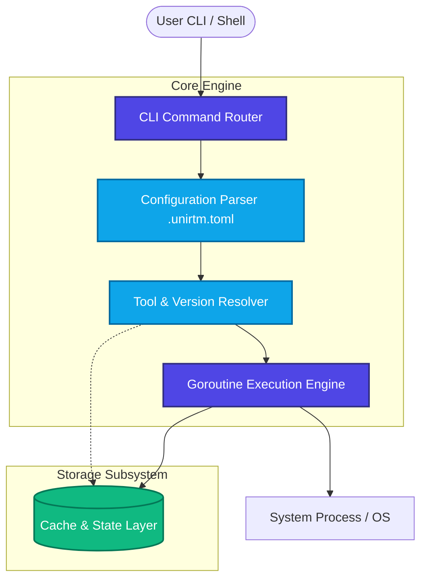
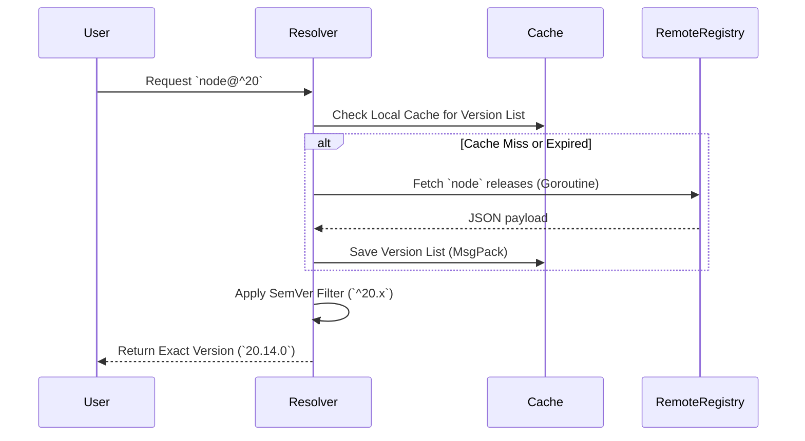

# Architecture Deep Dive

UniRTM is engineered from the ground up to be a high-performance, **100% native Go** application. Unlike legacy tool managers that rely heavily on shell scripts, bash hooks, or Ruby plugins, UniRTM executes directly as a compiled binary. This design choice provides exceptional speed, strict memory safety, and cross-platform reliability.

## Core Tenets

1. **Zero Shell Pollution**: UniRTM does not inject complex initialization scripts into your `.bashrc` or `.zshrc`. It dynamically modifies the `PATH` during tool execution and immediately restores it.
2. **Native Performance**: By avoiding subshells (`bash -c`), UniRTM reduces the overhead of process spawning to almost zero.
3. **Concurrency First**: All heavy operations—such as remote version resolution, artifact downloading, and checksum validation—are executed concurrently using Go's lightweight goroutines.

## High-Level Architecture

The UniRTM core is divided into four primary subsystems:

1. **The Command Router (`cli` layer)**
2. **The Resolution Pipeline (`resolver` layer)**
3. **The Execution Engine (`engine` layer)**
4. **The Storage & Caching Layer (`cache` layer)**

### 1. The Command Router

When a user invokes a command (e.g., `unirtm use node@20`), the command router:

- Parses flags and arguments using `cobra`.
- Instantiates the application context.
- Validates the requested plugins against the remote registry.

### 2. The Resolution Pipeline

The hardest part of a tool manager is accurately resolving constraints (e.g., `node@^20.1`) against available remote versions.
UniRTM uses a multi-stage resolution pipeline:

### 3. Execution Engine

UniRTM leverages Go's `os/exec` package to run tools natively. When you run a tool managed by UniRTM, the engine:

1. Calculates the exact `PATH` string required for the requested tools.
2. Clones the current environment variables.
3. Injects the new `PATH` and any `.unirtm.toml` variables into the clone.
4. Spawns the child process and pipes `stdin`, `stdout`, and `stderr` directly to the user's terminal without a middleman subshell.

This guarantees that signals (`SIGINT`, `SIGTERM`) are propagated correctly and terminal colors/TTY states are preserved.
