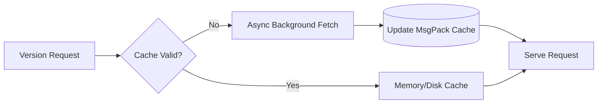
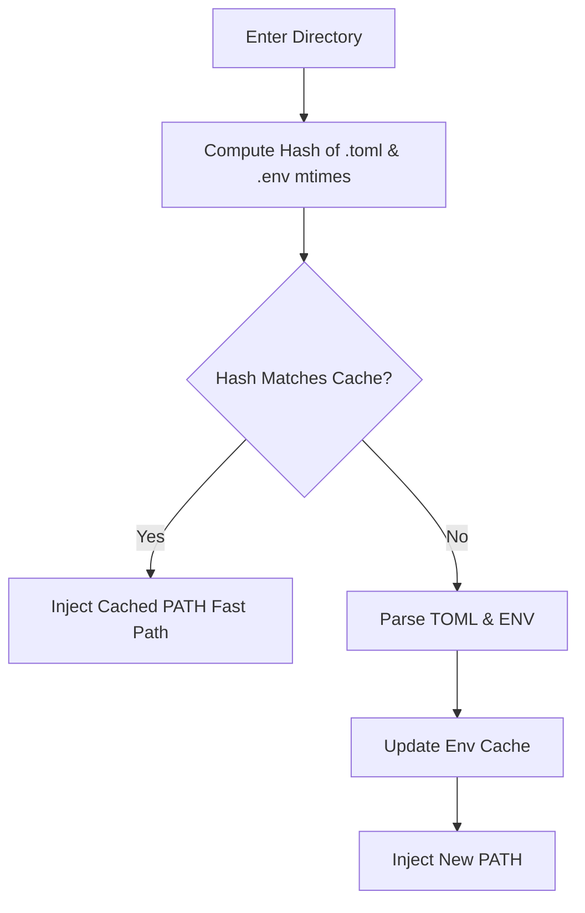

# Cache Behavior Deep Dive

UniRTM is obsessed with speed. To achieve its sub-millisecond overhead, UniRTM heavily relies on an aggressive, yet safe, multi-tier caching strategy.

## Cache Layers

There are three primary layers of caching within UniRTM:

1. **Remote Registry Cache**: Caches the list of available versions for tools.
2. **Environment Evaluation Cache**: Caches the computed environment and `PATH` per directory.
3. **Artifact Cache**: Caches downloaded binaries and plugin definitions.

### 1. Remote Registry Cache

When UniRTM needs to resolve a fuzzy version constraint (e.g., `node@^20`), it must know what versions exist.
Querying GitHub or the Node distribution servers on every execution would be prohibitively slow.

Instead, UniRTM performs a background fetch and caches the entire version manifest locally.

**Key Optimizations**:

- **Format**: Data is serialized using `MsgPack` and compressed with `zstd`. This reduces a 5MB JSON payload to ~300KB, slashing disk I/O read times.
- **TTL Pruning**: Cached manifests have a Time-To-Live (TTL) of 24 hours. UniRTM automatically prunes expired caches in the background (using a detached Goroutine) to prevent disk bloat without blocking the main execution path.

### 2. Environment Evaluation Cache

One of UniRTM's unique features is "Zero Shell Pollution." Instead of modifying your global shell profile, UniRTM evaluates the `.unirtm.toml` and `.env` files in your current directory dynamically.

To prevent re-parsing TOML and `.env` files on every single keystroke or command invocation, UniRTM caches the "diff" of the environment based on the directory's absolute path and the `mtime` (modified time) of the configuration files.

### 3. Artifact Cache

Downloaded tool binaries are stored centrally (defaulting to `~/.local/share/unirtm/installs/`).
UniRTM uses hard links (where supported by the OS) when a user requests the same tool version across different local projects, minimizing disk footprint drastically compared to `node_modules`-style localized copies.
