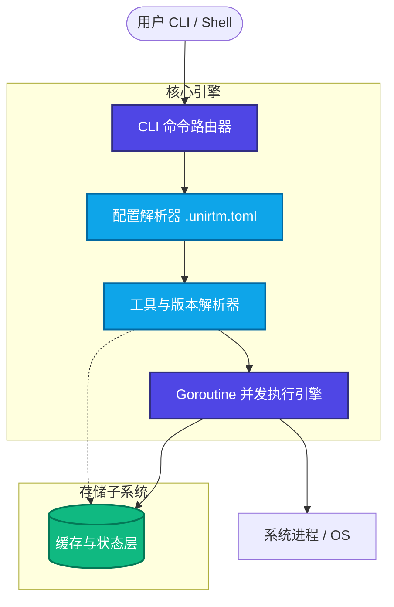
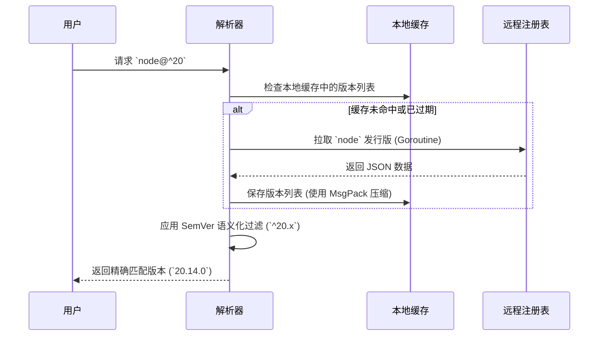

# 架构深度剖析 (Architecture Deep Dive)

UniRTM 从底层开始就是为了极致性能而生的。它是一个 **100% 纯 Go 语言** 编写的编译型应用。与依赖大量 Shell 脚本、Bash 钩子或 Ruby 插件的传统工具管理器不同，UniRTM 直接作为原生二进制文件执行。这一设计带来了惊人的启动速度、严格的内存安全以及全平台的完美兼容。

## 核心设计哲学

1. **零 Shell 污染 (Zero Shell Pollution)**：UniRTM 不会向您的 `.bashrc` 或 `.zshrc` 中注入臃肿的初始化脚本。它仅在工具执行时动态修改 `PATH`，并在执行结束后立即还原。
2. **原生性能 (Native Performance)**：通过彻底抛弃子 shell (`bash -c`) 代理，UniRTM 将进程派生的开销降到了最低。
3. **并发优先 (Concurrency First)**：所有繁重的操作——如远程版本解析、构件下载、哈希校验——均由 Go 轻量级的 Goroutines 并发执行。

## 高层架构 (High-Level Architecture)

UniRTM 的核心由四个主要子系统构成：

1. **命令路由层 (`cli` layer)**
2. **解析流水线 (`resolver` layer)**
3. **执行引擎 (`engine` layer)**
4. **存储与缓存层 (`cache` layer)**

### 1. 命令路由层 (The Command Router)

当用户输入命令（例如 `unirtm use node@20`）时，命令路由层会：

- 使用 `cobra` 解析参数和标志。
- 初始化应用上下文 (Context)。
- 校验请求的插件是否存在于远程注册表中。

### 2. 解析流水线 (The Resolution Pipeline)

工具管理器最复杂的部分在于版本约束解析（如 `node@^20.1`）。UniRTM 采用多阶段解析流水线：

### 3. 执行引擎 (Execution Engine)

UniRTM 利用 Go 的 `os/exec` 标准库原生运行工具。当您运行受管工具时，引擎会：

1. 精确计算所需的 `PATH` 环境变量字符串。
2. 克隆当前的环境变量快照。
3. 将新的 `PATH` 以及 `.unirtm.toml` 中定义的变量注入到快照中。
4. 派生子进程，并将 `stdin`、`stdout` 和 `stderr` 直接绑定到用户的终端，无需任何中间 Shell 代理。

这一机制确保了进程信号（如 `SIGINT`, `SIGTERM`）能被正确传递，同时完美保留了终端颜色和 TTY 交互状态。
