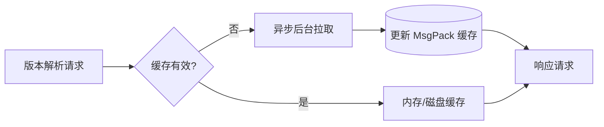
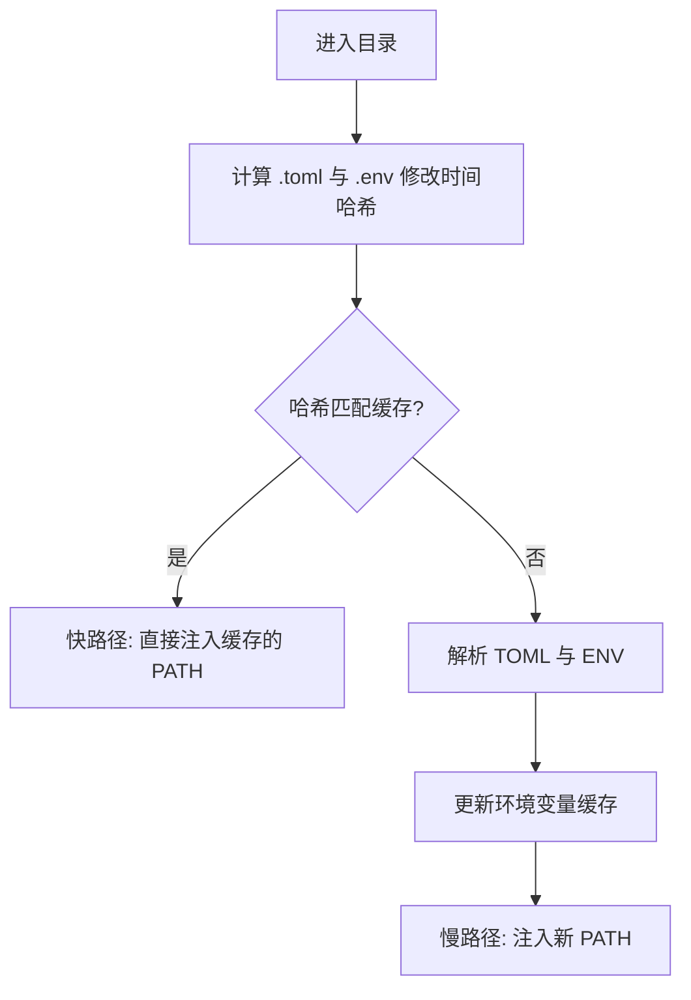

# 缓存策略深度剖析 (Cache Behavior Deep Dive)

UniRTM 对速度有着近乎偏执的追求。为了实现亚毫秒级的执行开销，UniRTM 深度依赖一套极其激进但也绝对安全的多级缓存策略。

## 缓存分层 (Cache Layers)

在 UniRTM 内部，主要存在三个维度的缓存：

1. **远程注册表缓存 (Remote Registry Cache)**：缓存工具的可用版本列表。
2. **环境求值缓存 (Environment Evaluation Cache)**：按目录缓存计算后的环境变量与 `PATH`。
3. **构件缓存 (Artifact Cache)**：缓存已下载的二进制文件与插件定义。

### 1. 远程注册表缓存

当 UniRTM 需要解析一个模糊的版本约束时（例如 `node@^20`），它必须知道当前都有哪些版本可用。
如果在每次执行时都去请求 GitHub 或 Node 的分发服务器，网络延迟将导致性能灾难。

因此，UniRTM 会在后台执行拉取，并将完整的版本清单缓存到本地。

**核心优化点**：

- **存储格式**：数据使用 `MsgPack` 序列化，并配合 `zstd` 进行压缩。这能将 5MB 的 JSON 负载压缩至大约 300KB，极大地削减了磁盘 I/O 读取时间。
- **TTL 自动修剪**：缓存清单的生存时间 (TTL) 默认为 24 小时。UniRTM 会在后台（使用独立的 Goroutine）自动清理过期的缓存，既防止了磁盘空间膨胀，又不会阻塞主线程的执行路径。

### 2. 环境求值缓存

UniRTM 的一大特色是“零 Shell 污染”。它不需要在你的全局 shell 配置文件中写入冗长的初始化代码，而是动态评估你当前目录下的 `.unirtm.toml` 和 `.env` 文件。

为了避免在每一次敲击键盘或调用命令时都去重新解析 TOML 和 `.env` 文件，UniRTM 基于目录的绝对路径以及配置文件的 `mtime`（修改时间）对环境变量的“Diff（差异）”进行了缓存。

### 3. 构件缓存

下载的工具二进制文件被集中存放在本地（默认为 `~/.local/share/unirtm/installs/`）。
当用户在不同的本地项目中请求相同的工具版本时，UniRTM 会尽可能利用操作系统底层的硬链接 (Hard Links) 技术。这与 `node_modules` 这种每个项目复制一份的模式相比，成倍地节省了磁盘空间。
