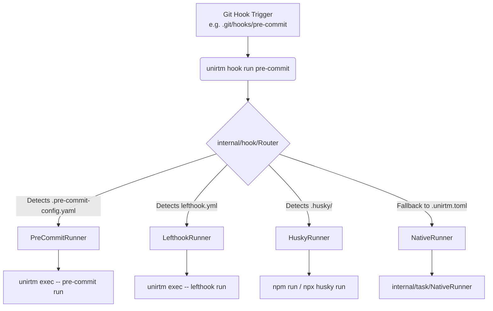

# Implementation Plan: Git Hook Module

**Branch**: `013-git-hook-module` | **Date**: 2026-06-06 | **Spec**: N/A
**Input**: Feature specification from `specs/013-git-hook-module/spec.md`

## Summary

Add native Git Hook management to UniRTM using a multi-engine runner architecture. The module will act as a unified facade, allowing developers to run `unirtm hook install` to seamlessly bridge `.git/hooks` with various backend engines (`pre-commit`, `husky`, `lefthook`, or UniRTM's native TOML configuration), providing a zero-friction developer experience across languages.

## Technical Context

**Language/Version**: Go 1.21+
**Primary Dependencies**: Standard library (`os/exec`, `path/filepath`, `strings`)
**Storage**: N/A
**Testing**: Go standard testing suite
**Target Platform**: Linux, macOS, Windows (requires cross-platform script generation compatible with git-bash)
**Project Type**: CLI tool
**Performance Goals**: <50ms overhead for the routing layer
**Constraints**: Must fail fast and forward exact exit codes to git to ensure commits abort correctly on failure.
**Scale/Scope**: Impacts all `unirtm hook` commands and subcommands.

## Constitution Check

*GATE: Must pass before Phase 0 research. Re-check after Phase 1 design.*
- **Idempotency**: `unirtm hook install` must be safely re-runnable without duplicating code.
- **Cross-Platform Compatibility**: The injected hook script must execute cleanly under Windows (git-bash), macOS, and Linux.

## Project Structure

### Documentation (this feature)

```text
specs/013-git-hook-module/
├── plan.md              # This file
├── research.md          # Output of Phase 0
├── data-model.md        # Output of Phase 1
└── contracts/           # Output of Phase 1
```

### Source Code (repository root)

```text
internal/
└── hook/
    ├── runner.go        # Interface definition for HookRunner
    ├── router.go        # Iterates and executes the appropriate runner
    ├── native.go        # Implements NativeRunner (reads .unirtm.toml [hooks])
    ├── precommit.go     # Implements PreCommitRunner
    ├── husky.go         # Implements HuskyRunner
    └── lefthook.go      # Implements LefthookRunner

cmd/
└── hook.go              # CLI definitions: `unirtm hook install` / `run`
```

**Structure Decision**: A new module under `internal/hook/` perfectly mirrors the existing `internal/task/` runner pattern, promoting code reusability and symmetric design.

## Architecture Design



## Interface Definitions (Go)

```go
package hook

import "context"

// HookRunner defines the interface for all supported git-hook engines
type HookRunner interface {
	// Detect returns true if this engine's config exists in the workspace
	Detect(dir string) bool
	
	// Install injects the bridge script into .git/hooks/ or runs engine-specific setup
	Install(ctx context.Context, dir string) error
	
	// Run executes the specific hook (e.g., "pre-commit", "commit-msg")
	Run(ctx context.Context, hookName string, args []string) error
	
	// Name returns the identifier of the engine
	Name() string
}
```

## Git Interaction Scripts (Bridge Script)

The bridge script injected into `.git/hooks/pre-commit` (and other hooks) will look like this:

```bash
#!/bin/sh
# Code generated by UniRTM; DO NOT EDIT.

# Load environment for GUI Git clients (Sourcetree, GitHub Desktop)
if [ -f ~/.profile ]; then source ~/.profile; fi
if [ -f ~/.bashrc ]; then source ~/.bashrc; fi

if command -v unirtm >/dev/null 2>&1; then
    exec unirtm hook run $(basename "$0") "$@"
else
    echo "⚠️ UniRTM not found in PATH. Skipping hook."
    exit 0
fi
```

## Routing Logic

When `unirtm hook run <hookName>` is invoked:
1. Iterate through `[]HookRunner{PreCommitRunner{}, LefthookRunner{}, HuskyRunner{}, NativeRunner{}}`.
2. Call `Detect(cwd)` sequentially.
3. The first runner that returns `true` is selected.
4. Call `Run(ctx, hookName, os.Args[3:])`.
5. Return the exact exit code of the underlying tool.

## Complexity Tracking

| Violation | Why Needed | Simpler Alternative Rejected Because |
| ----------- | ------------ | ------------------------------------- |
| Shell Env Injection (`~/.profile`) | GUI Git clients lack user `$PATH` | Without it, GUI commits will fail `command not found: unirtm`. |

## Open Questions / Review Required

1. **Fallback Hook Behavior**: If `.git/hooks/pre-commit` exists and is NOT managed by UniRTM, should `unirtm hook install` overwrite it, fail, or prompt the user?
2. **Missing Dependency Handling**: If `PreCommitRunner` is detected but `pipx:pre-commit` is missing, should we auto-install it or throw an error?
